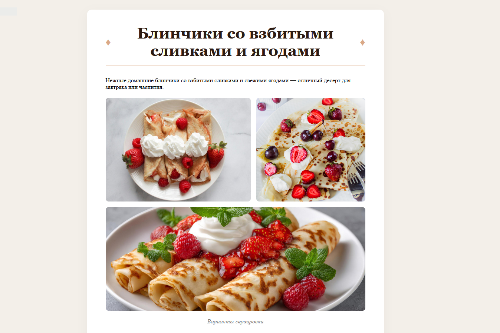

# Interactive Recipe Landing Page

A responsive and interactive single-page website featuring a delicious recipe, built with modern frontend technologies.

[🔗 View Live Demo](https://tut-e.github.io/interactive-recipe-website/)

---

## 🚀 Features

* **Adaptive Image Gallery:** Opens images in a full-screen Lightbox modal on desktop, and automatically transforms into a touch-friendly scrollable carousel on mobile devices.
* **Interactive Ingredients Checklist:** Allows users to dynamically cross out or check off ingredients they already have, making the cooking process easier to track.
* **Responsive Web Design:** Fully optimized for all screen sizes, from small mobile viewports to large desktop monitors.
* **Semantic HTML:** Built with accessibility and SEO best practices in mind.
* **Clean Code Structure:** Modular CSS styles and organized JavaScript logic.

## 🛠️ Tech Stack

* **HTML5:** Semantic architecture.
* **CSS3:** Custom styling using [Flexbox] layout, clean typography, and smooth transitions.
* **JavaScript (ES6+):** Vanilla JS for DOM manipulation and interactive features.

## 📸 Preview

 

---

## 🗂️ Project Structure

```text
├── images/          # Image assets and icons
├── index.html       # Main HTML document
├── js/script.js     # JavaScript for interactive features
└── css/style.css    # Custom CSS stylesheets
```

## ✍️ Author

* **Tute** - [Your GitHub Profile](https://github.com/tut-e)
